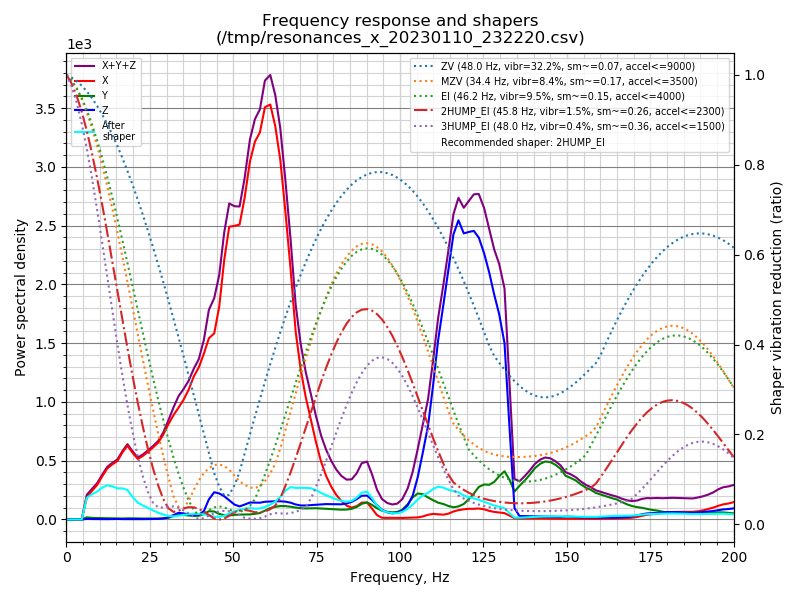
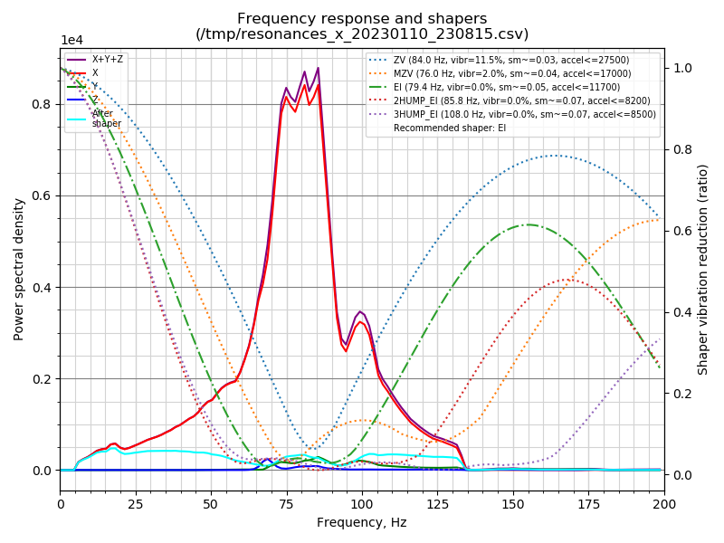

# Voron V0 - dual rail mod for Mini-AfterSherpa
One of the limitations on the path to better print quality, higher accelerations, less ringing is rigidity of the printer. Weakest point in Voron V0 is arguably X-rail carriage. I believe that dual MGN7 offers more rigidity / less play than even single MGN9 rail due to less "amplification of backlash". In my view the only competing single-rail approach offering similar rigidity is Pandora-style rail mount on the front (https://github.com/MasturMynd/Pandora), preferably with wide rail (MGW7 / MGW9) - but this is just a dream at the moment. 

I've tried 3 different single MGN7 rails with medium preload from different suppliers and was never satisfied with hotend wiggle. This mod dramatically increases rigidity, so that on resonance tower I no longer see much  ringing even without input shaping (=sharper, faster, higher quality prints). 

Original dual rail mod by [@camerony](https://github.com/camerony) (https://github.com/camerony/VoronCustom/tree/main/V0.1_Dual_X_Rail_Carriage) is not compatible with Mini-AfterSherpa (https://github.com/PrintersForAnts/Mini-AfterSherpa) - as it lowers mount point too much, so extruder would collide with the X bracket (unless you install extruder backwards which will severely limit Y travel range). 

In this mod - bracket is redesigned, mount points are shifted up 2mm.
As rigidity of dual rail is much higher than needed - feel free to reduce infill to 25% and perimeters to 3 in the bracket if you want to save ~1g.

Thickness of bottom part of the bracket is reduced to 2mm to make it easier to clear extrusions of Z axis. 

# Travel range
* XY travel range is unaffected. 
* Z travel range is increased by 2mm. 
* Free space above carriage is reduced by 2mm, so you will benefit with any of tophat mods with more space. 

# Homing
It only supports sensorless homing on X axis. If we are saving weight - we must drop X endstop. 
As motors might slightly touch bottom carriage - homing procedure must be changed:

* Home Y axis first, then go to Y coordinate 60
* Home X axis, then go to X coordinate 60
* Do final Y axis homing

This will ensure reliable homing regardless on position where it was left before. Triple homing is slower, but you can do it while heating up. Alternatively, you can add ~1mm spacers to make sure Y axis stops slightly before carriage can touch motors. Example sensorless homing config macro is included. 

Alternatively, one can home to Y0 instead of Ymax. 

# Requires
* Second 150mm MGN7 rail with MGN7H carriage, medium preload. 
* Mod to raise X rail by 4mm : https://github.com/camerony/VoronCustom/tree/ebe7d462dfbc9d7f2f023d78ec90f3b2affd35e5/V0.1_Raise_X_Axis_Extrusion_by_4mm
* 4x M2x5mm or M2x6mm screws to mount bottom rail. Recommended to get ultrathin ones, as it's quite tight on the bottom. If screws hit extrusions, and you only have regular hex screws - you can sand them down by ~0.5mm to make thinner head.
* 2x M3 heat inserts

# Resonance comparison
Note different amplitude scale. Recommended acceleration is 5x better. More prominent difference in on X, on Y everything is too wobly on single rail: 

Single rail:

Double rail:

# Photos

