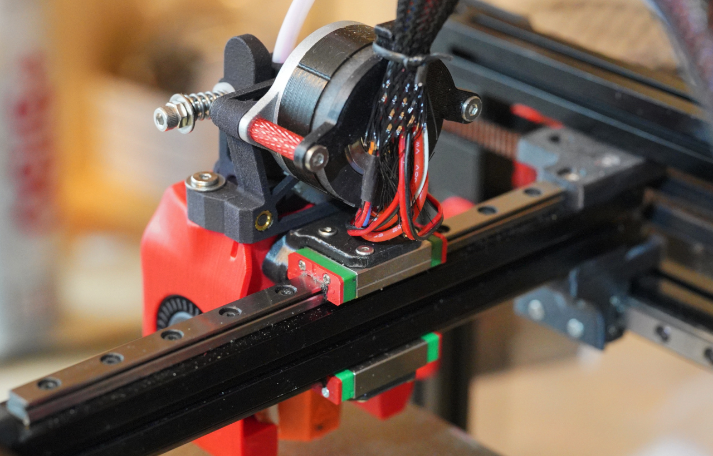
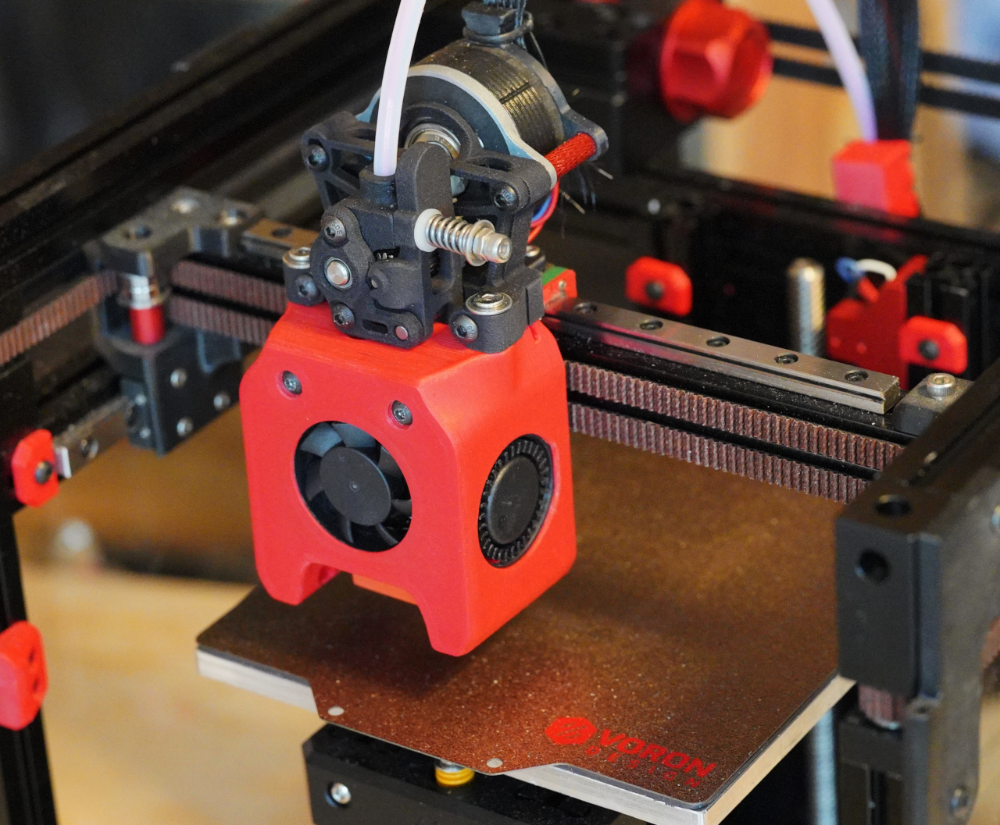

# Voron V0 - dual rail mod for mini-aftersherpa
I believe that dual MGN7 offers more rigidigy / less play than even single MGN9 rail. I tried 3 different single MGN7 rails with medium preload from different suppliers and was never satisfied with hotend wiggle. 

Original dual rail mod by @camerony (https://github.com/camerony/VoronCustom/tree/main/V0.1_Dual_X_Rail_Carriage) is not compatible with mini-aftersherpa - as it lowers mount point too much, so extruder would collide on the X bracket (unless you install it backwards which will severely limit Y travel range). 

In this mod - bracked is redesigned, mount points are shifted up 2mm.
As rigidigy of dual rail is much higher than needed - feel free to reduce infill to 20% and perimeters to 3 in the bracket if you want to save ~1g.

Thickness of bottom part of the bracket is reduced to 2mm to make it easier to clear extrusions of Z axis. 

XY travel range is unaffected. 
Z travel range is increased by 2mm. 
Free space above carriage is reduced by 2mm, so you will benefit of any of tophat mods with more space. 

# Requires
* Second 150mm MGN7 rail with MGN7H carriage, medium preload. 
* Mod to raise X rail by 4mm : https://github.com/camerony/VoronCustom/tree/ebe7d462dfbc9d7f2f023d78ec90f3b2affd35e5/V0.1_Raise_X_Axis_Extrusion_by_4mm
* 4x M2x5mm or M2x6mm screws to mount bottom rail. Recommended to get ultrathin ones, as it's quite tight on the bottom. If scews hit extrusions, and you only have regular hex screws - you can sand them down by ~0.5mm to make thinner head.
* 2x M3 heat inserts

